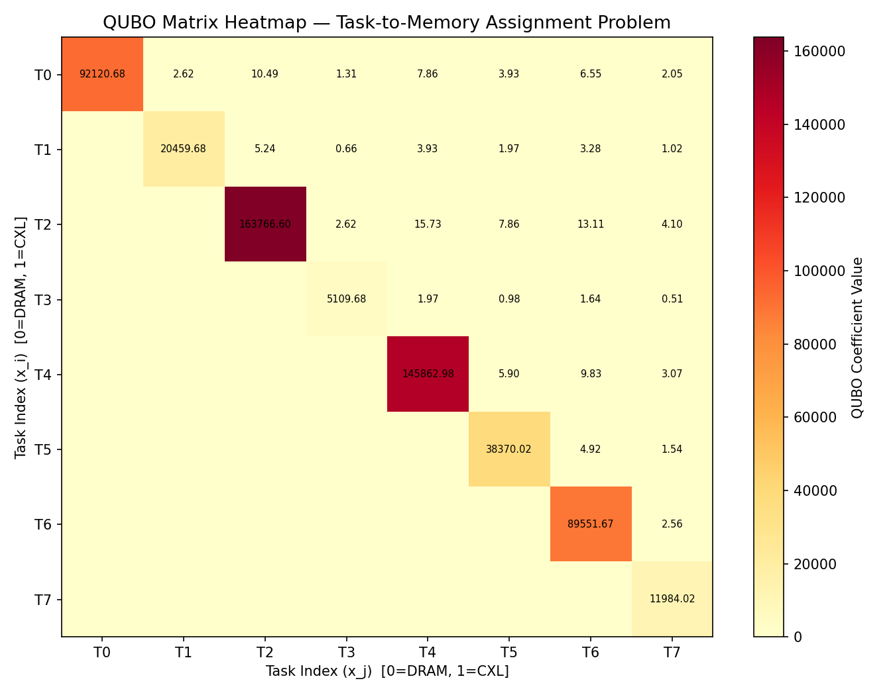

# Quantum-Assisted Optimization Engine for CXL-Aware Hybrid Scheduling

**Team:** Anjana · Hari · Smarth · Vikas · Devandra
**Institution:** BMS College of Engineering
**Department:** Information Science and Engineering

---

## What This Project Does

This project builds a quantum-assisted memory scheduler that decides which tasks should go into fast **DRAM** memory and which go into slower **CXL-attached** memory — using the Recursive Quantum Approximate Optimization Algorithm (RQAOA) to make near-optimal placement decisions.

---

## Quick Start

```bash
# Clone the repo
git clone https://github.com/zealot-zew/Quantum-Computing.git
cd Quantum-Computing

# Set up environment
python -m venv venv
venv\Scripts\activate        # Windows
source venv/bin/activate     # Linux/macOS

# Install dependencies
pip install -r requirements.txt

# Run all schedulers benchmark
python run_benchmarks.py

# Run a specific scheduler
python main.py --scheduler fcfs
python main.py --scheduler greedy
python main.py --scheduler rqaoa
```

---

## Project Structure

```
Quantum-Computing/
├── src/
│   ├── rqaoa/
│   │   ├── qubo_builder.py          # Builds the QUBO matrix
│   │   ├── qubo_converter.py        # PyQUBO → OpenQAOA format
│   │   ├── rqaoa_runner.py          # Core RQAOA optimizer
│   │   ├── rqaoa_config.py          # Algorithm constants
│   │   ├── run_rqaoa_pipeline.py    # Full end-to-end pipeline
│   │   └── result_parser.py        # Decodes bitstring to tier map
│   ├── scheduler/
│   │   ├── scheduler_interface.py  # BaseScheduler abstract class
│   │   ├── fcfs_scheduler.py       # First-Come-First-Served
│   │   ├── greedy_scheduler.py     # Sensitivity-based greedy
│   │   ├── round_robin_scheduler.py # Round Robin
│   │   ├── greedy_priority_scheduler.py # Priority-weighted greedy
│   │   ├── task_model.py           # Task dataclass
│   │   └── tasks.py                # Canonical 8-task set
│   ├── executor/
│   │   └── task_orchestrator.py    # Concurrent subprocess launcher
│   └── evaluation/
│       ├── metrics.py              # Latency cost, makespan, utilization
│       └── graphs.py               # Bar chart generators
├── tests/                          # Unit tests for all modules
├── docs/                           # Architecture and deployment guides
├── results/                        # Generated CSVs and plots
├── task_runner.py                  # Per-task memory simulation
├── run_benchmarks.py               # Full benchmark runner
├── main.py                         # CLI entry point
└── requirements.txt                # All dependencies
```

---

## Benchmark Results

All 5 schedulers benchmarked against the canonical 8-task set (3904 MB total, 2048 MB DRAM capacity):

| Scheduler | DRAM Tasks | CXL Tasks | Avg Time (s) | Makespan (s) | DRAM Util % | Latency Cost (ns·MB) |
|-----------|------------|-----------|-------------|-------------|-------------|----------------------|
| FCFS | 4 | 4 | 1.813 | 6.059 | 93.8% | 592,000 |
| Round Robin | 2 | 6 | 1.370 | 3.745 | 75.0% | 638,080 |
| **Greedy** | **4** | **4** | 2.294 | 10.127 | **100.0%** | **553,600** |
| **Priority-Weighted Greedy** | **4** | **4** | 2.170 | 7.518 | **100.0%** | **553,600** |
| RQAOA (fallback*) | 0 | 8 | 2.231 | 9.061 | 0.0% | 904,320 |

*RQAOA fallback used (OpenQAOA not installed locally). Quantum result pending Day 5 AWS run.*

**Winner: Greedy and Priority-Weighted Greedy** — 553,600 ns·MB latency cost, 100% DRAM utilisation.

---

## QUBO Matrix Heatmap

The heatmap shows the cost of placing each task in CXL memory. Darker = higher cost = must go to DRAM.



**Interpretation:**
- T2 (163,766) and T4 (145,862) — highest cost, must go to DRAM
- T7 (11,984) and T3 (5,109) — lowest cost, can go to CXL

---

## Results Plots

### Latency Cost Comparison


*Total weighted latency cost per scheduler. Lower is better. Greedy achieves the minimum.*

### Makespan Comparison


*Total wall-clock time from first task start to last task end. Round Robin is fastest but has the worst latency cost.*

### DRAM Utilisation


*Percentage of available DRAM used. Greedy achieves 100% utilisation — no fast memory wasted.*

---

## System Architecture

```
Input Tasks (8)
      ↓
QUBO Builder → 19×19 Q matrix (8 task bits + 11 slack bits)
      ↓
QUBO Converter → OpenQAOA integer-key format
      ↓
RQAOA Optimizer → bitstring assignment (p=3, COBYLA, cutoff=8)
      ↓
Result Parser → {task_id: "DRAM" or "CXL"}
      ↓
Task Orchestrator → 8 concurrent subprocesses
      ↓
task_runner.py × 8 → numactl bound, 3× CXL latency injected
      ↓
Metrics → execution_log.csv + all_schedulers_summary.csv
      ↓
Graphs → results/plots/
```

---

## Team

| Person | Role | Key Contributions |
|--------|------|------------------|
| Anjana (P1) | Quantum Algorithm | QUBO builder, RQAOA runner, pipeline |
| Hari (P2) | Infrastructure | Task orchestrator, task runner, QUBO converter |
| Smarth (P3) | Classical Schedulers | FCFS, RR, Greedy, Priority schedulers |
| Vikas (P4) | Evaluation | Metrics, plots, CSV schemas |
| Devandra (P5) | Docs & Integration | Report, BaseScheduler, requirements, PR reviews |

---

## Key Constants

| Constant | Value | Meaning |
|----------|-------|---------|
| DRAM_LATENCY_NS | 100 ns | Baseline DRAM access latency |
| CXL_LATENCY_NS | 300 ns | CXL-attached memory latency |
| DRAM_CAPACITY_MB | 2048 MB | Simulated DRAM capacity |
| CXL_CAPACITY_MB | 4096 MB | Simulated CXL capacity |
| RQAOA_LAYERS | 3 | QAOA circuit depth |
| RECURSIVE_CUTOFF | 8 | Variable count for classical switch |
| SHOTS | 1024 | Measurements per circuit evaluation |

---

*Maintained by Devandra (P5 — Documentation & Integration Lead)*